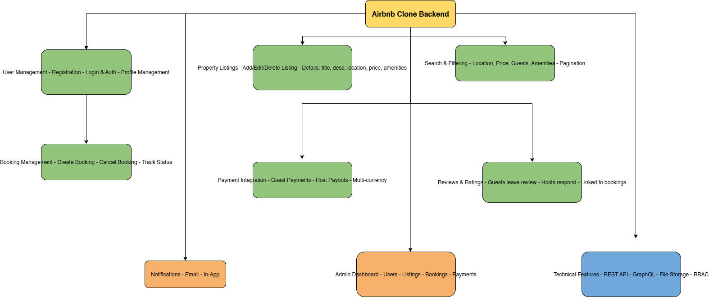

# Airbnb Clone Backend Features & Functionalities

This directory contains a visual documentation of the backend features and functionalities for the Airbnb Clone project. 
It includes user authentication, property management, booking system, payments, reviews, notifications, and admin dashboard functionalities.

## Diagram
