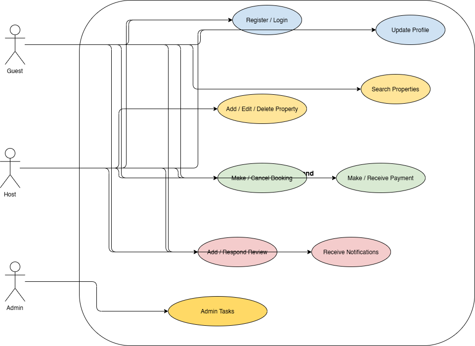

# Use Case Diagram – Airbnb Clone Backend

## Overview
This use case diagram visualizes the key interactions between actors and the Airbnb Clone backend system. It highlights the main functionalities that the backend supports and how different users interact with the system.

## Actors
- **Guest**: A user who can browse properties, make bookings, leave reviews, and receive notifications.
- **Host**: A user who can manage property listings, handle bookings, respond to reviews, and receive notifications.
- **Admin**: Oversees the system, managing users, listings, bookings, payments, and other administrative tasks.

## Key Functionalities
- **User Management**
  - Registration and login
  - Profile management
- **Property Management**
  - Add, edit, and delete property listings
  - Search and filter properties
- **Booking and Payments**
  - Make and cancel bookings
  - Handle payment processing
- **Reviews and Notifications**
  - Leave and respond to reviews
  - Receive booking and payment notifications
- **Admin Tasks**
  - Monitor and manage users, listings, bookings, and payments

## Diagram
